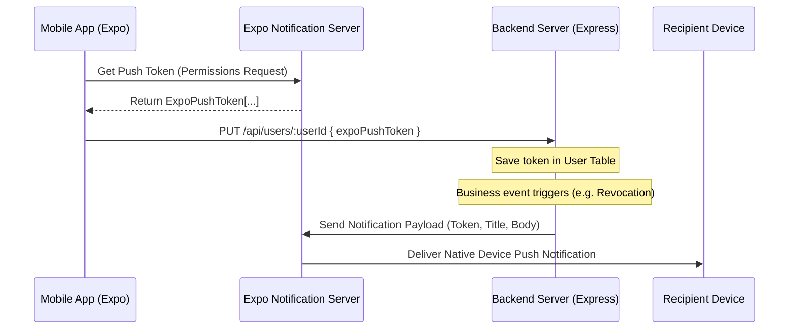

# Bajaj Operations Management System - Integration Guide

This guide details the integration layer connecting the Expo-based React Native mobile application and the NodeJS/Express backend, explaining key integration mechanisms, dynamic bindings, and state synchronizations.

---

## 1. Network Layer & Dynamic API Endpoint Binding
The mobile application uses **Axios** to communicate with the backend services. The network client is initialized in `mobile-app/src/services/api/client.ts` and configures a dynamic API endpoint binding:

```typescript
import axios from "axios";

export const apiClient = axios.create({
  baseURL: process.env.EXPO_PUBLIC_API_URL || "http://192.168.29.113:5000/api",
  timeout: 15000,
});
```

### Key Integration Points:
*   **Fallback Local IP**: By default, the application falls back to port `5000` on the developer's local area network IP (`http://192.168.29.113:5000/api`), allowing physical testing devices on the same Wi-Fi connection to reach the development server.
*   **Environment Override**: In production or staging, the endpoint is overridden dynamically via the `EXPO_PUBLIC_API_URL` environment variable.

---

## 2. Authentication Flow & Role Switching
The system maintains a seamless role switching interface for testing operations across the entire hierarchy. 

### 1. Role Switch Mechanism
The `switchRole(role)` function in `AppContext.tsx` programmatically authenticates the current profile:

```typescript
const switchRole = useCallback(async (role: RoleId) => {
  setLoading(true);
  try {
    let email = "";
    if (role === "lc") email = "shitaldevnath1@gmail.com";
    else if (role === "branchManager") email = "ishwarrajput@gmail.com";
    else if (role === "rm") email = "ravinemalikanti@gmail.com";

    // Authenticate with default testing password
    const res = await apiClient.post("/auth/login", { email, password: "123456789" });
    const { token: userToken, user: userProfile } = res.data;

    // Dynamically inject Bearer token into all subsequent requests
    apiClient.defaults.headers.common["Authorization"] = `Bearer ${userToken}`;
    setToken(userToken);
    setCurrentUser(userProfile);

    dispatch({ type: "SWITCH_ROLE", role });
    showToast(`Switched scope to ${userProfile.name}`);
  } catch (e: any) {
    console.error("Authentication switch failed: ", e);
    showToast("Auth failed: " + (e.response?.data?.message || e.message));
  } finally {
    setLoading(false);
  }
}, [showToast]);
```

### 2. Login Expiration
The JWT tokens issued by the backend are signed with a **7-day lifespan** (matching mobile application login retention requirements), reducing credentials re-entry frequency for personnel.

---

## 3. Lazy-Loading Page-Refresh Architecture
To minimize mobile bandwidth usage, the application implements a page-level lazy loading scheme. Instead of downloading the full database on boot, the `refreshData` method inspects the currently active tab or page and queries only the necessary API endpoints:

```typescript
const getEndpointsForPage = (page: string, role: string): string[] => {
  const common = ["/notifications"];
  switch (page) {
    case "home":
    case "dashboard":
      if (role === "lc") return ["/tasks", ...common];
      if (role === "branchManager") return ["/branches", "/approvals", "/visits", ...common];
      if (role === "rm") return ["/branches", "/complaints", "/approvals", "/visits", ...common];
      return common;
    case "tasks":
      return ["/tasks"];
    case "complaints":
    case "issues":
      return ["/complaints", "/branches"];
    case "branch":
    case "branches":
    case "intelligence":
    case "analytics":
      return ["/branches", "/users", "/appliances"];
    case "monitoring":
      return ["/tasks", "/branches"];
    case "approvals":
    case "finance":
      return ["/approvals", "/branches"];
    case "visits":
      return ["/visits", "/branches"];
    case "attendance":
      if (role === "lc") return ["/attendance/my-calendar", "/tasks"];
      return ["/attendance/my-calendar", "/users", "/branches"];
    case "users":
      return ["/users", "/branches"];
    case "notifications":
    case "alerts":
      return ["/notifications", "/branches"];
    default:
      return common;
  }
};
```

### Refresh Trigger Events:
1.  **Page Switch**: When `state.page` changes, the corresponding endpoints are queried automatically.
2.  **User Actions**: Triggering methods like `markTaskDone`, `markAttendance`, or `approveRequest` triggers a `refreshData()` callback upon success, updating only the affected scopes.

---

## 4. Type Alignment & UUID Mapping
Because the database utilizes UUID strings (`String` type in Prisma schema) whereas the legacy UI mock components supported numbers (`number`), the mobile app implements dynamic conversion wrappers inside the context layer:

1.  **Relation Object Normalization**: `refreshData` aligns relational database columns with the formats expected by React Native UI controls:
    ```typescript
    const mappedTasks = rawTasks.map((t: any) => ({
      ...t,
      assignedTo: t.assignedToId || t.assignedTo,
      assignedBy: t.assignedById || t.assignedBy,
      completedBy: t.completedById || t.completedBy,
    }));
    ```
2.  **Flexible IDs**: Component interfaces were refactored to support `string | number` parameters, preventing rendering failures due to UUID keys.

---

## 5. Safe Rendering of Relational Details (Timeline Logs)
Complaint timelines are tracked as status event logs. To prevent JSON structure variations from breaking the front-end layout engine, a parsing guard is executed:

```typescript
const mappedComplaints = rawComplaints.map((c: any) => {
  let parsedTimeline = [];
  try {
    if (c.timeline) {
      if (typeof c.timeline === "string") {
        const parsed = JSON.parse(c.timeline);
        parsedTimeline = Array.isArray(parsed) ? parsed : [parsed];
      } else if (Array.isArray(c.timeline)) {
        parsedTimeline = c.timeline;
      }
    }
  } catch (err) {
    console.error("Timeline parse error: ", err);
    parsedTimeline = [String(c.timeline)];
  }
  return {
    ...c,
    reportedBy: c.reportedById || c.reportedBy,
    timeline: parsedTimeline,
  };
});
```

---

## 6. Native Expo Push Notification Sync
The application features integration with native device push channels, linking specific users' mobile devices directly to system events:



### Front-End Registration Hook
During user login, the mobile app queries permission, fetches the push token, and stores it on the user's database row:
```typescript
useEffect(() => {
  if (!currentUser || !token || currentUser.id === "lc-dummy") return;

  const registerPushToken = async () => {
    try {
      let pushToken = "ExponentPushToken[mock-token-123456]";
      try {
        const Notifications = require("expo-notifications");
        const Device = require("expo-device");
        if (Device.isDevice) {
          const { status: existingStatus } = await Notifications.getPermissionsAsync();
          let finalStatus = existingStatus;
          if (existingStatus !== "granted") {
            const { status } = await Notifications.requestPermissionsAsync();
            finalStatus = status;
          }
          if (finalStatus === "granted") {
            const tokenData = await Notifications.getExpoPushTokenAsync();
            pushToken = tokenData.data;
          }
        }
      } catch (err) {
        console.log("Expo Push notification permissions skipped.");
      }

      await apiClient.put(`/users/${currentUser.id}`, {
        expoPushToken: pushToken
      });
    } catch (err) {
      console.error("Failed to register Expo push token on backend: ", err);
    }
  };

  registerPushToken();
}, [currentUser, token]);
```

---

## 7. Navigation Integration Correctness (Routing Bugfix)
Previously, the Regional Manager's navigation layout misdirected the Finance Tab click to the Branch Manager's issues screen due to a duplicate mapping key in `RootNavigator.tsx`. 

This was corrected by registering the `finance` routing target to the new `RmFinanceScreen` component:

```diff
-registerScreen("rm", "finance", BranchManagerIssuesScreen);
+registerScreen("rm", "finance", RmFinanceScreen);
```

This updates the layout of the Regional Manager's console, routing budget tracking clicks to the interactive capex/opex burn summaries.
