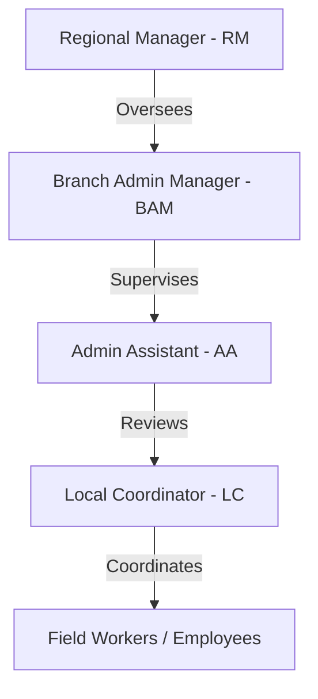

# Bajaj Operations Management System - Project Context

This document provides a comprehensive overview of the Bajaj Operations and Facilities Management Application, outlining the design goals, user hierarchies, architectural components, and core operational modules.

---

## 1. Project Goal & Scope
The application is an end-to-end operations platform designed to manage personnel, verify facility maintenance tasks, log geo-fenced attendance, track budgets, and manage appliance complaints across **189 branches**. 

The system is integrated with:
*   **PostgreSQL (Neon Cloud)**: A highly normalized relational database.
*   **Cloudinary API**: For secure hosting of image verification proofs.
*   **Expo Server SDK**: Dispatches real-time, native mobile push notifications to target user devices when business operations occur.

---

## 2. User Roles & Field of View
The system supports a hierarchical permission model with four primary roles. The field of view and operational capabilities scale according to the role:

### 1. Regional Manager (RM)
*   **Scope**: Global visibility across all **189 branches**.
*   **View**: Superuser regional dashboard, global branch health board, capex budget burn indices, RM watchlist, and escalations feed.
*   **Actions**: Approves high-cost expenditure requests (>₹20,000), manages global user permissions, reviews audit trails, and bookmarks system alerts.

### 2. Branch Admin Manager (BAM)
*   **Scope**: Multi-branch territory scope (typically overseeing a subset of branches, e.g., 18 branches).
*   **View**: Territory summary dashboard, branch comparisons, visit schedule queues, and territory-wide pending approvals.
*   **Actions**: Schedules auditor review visits, files visit reports, approves local branch expenses (up to ₹25,000 limit), assigns vendors to complaints, creates task cards, and registers new branch appliances or staff.

### 3. Admin Assistant (AA)
*   **Scope**: Territory scope under the BAM.
*   **View**: Operations tracking, attendance monitors, and task lists.
*   **Actions**: Reviews and completes standard checklists, verifies worker attendance logs, and assists the BAM in local coordination.

### 4. Local Coordinator (LC)
*   **Scope**: Single assigned branch.
*   **View**: Branch command center, branch staffing roster, appliance metrics lists, action task queues, and issue logs.
*   **Actions**: Logs geo-fenced attendance, posts weekly task plans, uploads photo proofs to Cloudinary to close critical tasks, files local complaints, and updates appliance records.

---

## 3. Core Operational Modules

### 1. Attendance & Shift Management
*   **Geo-Fencing**: Personnel punch in through coordinates. The app verifies proximity to the branch's coordinates (e.g., within 180m radius) and matches device IDs.
*   **Weekly Planning**: LCs submit a weekly task plan (including descriptions and estimated hours) upon checking in on Monday. This automatically generates task cards in the database.
*   **Logs**: Rolling calendar histories are displayed (15 days for LC, 5 days for managers) showing present/late/absent statuses and logged times.

### 2. Task Management & Verification
*   **Audience Scopes**: Tasks are scoped to specific audiences (`lc` or `worker`).
*   **Verification Cycle**: 
    1.  **Creation**: Managers assign tasks with deadlines and proof rules (e.g. `"Photo proof"`).
    2.  **Completion**: LCs or workers mark items complete. If proof is required, the LC uploads a photo proof to Cloudinary.
    3.  **Review**: Managers can review the submitted proof. If unsatisfactorily completed, the manager triggers a **Revocation**, adding a rework note and moving the task status back to `Revoked` with a new deadline.

### 3. Appliance Maintenance & Complaining
*   **Risk Metrics**: Branch dashboards monitor appliance status (`Operational`, `At Risk`, `Critical`, `Down`) and compute health indices.
*   **Complaint Pipeline**:
    1.  **Reporting**: LCs raise appliance/facility complaints with priority, description, and impact details.
    2.  **Triage**: Issues automatically alert supervising managers. Managers assign service vendors.
    3.  **Escalation**: If repair SLA thresholds pass without completion, issues escalate automatically through hierarchies (`LC -> BAM -> RM`), dispatching native push alerts at each stage.
    4.  **Resolution**: Vendors complete repairs, and managers mark the complaint resolved, restoring the appliance health score to 100%.

### 4. Budget & Expense Approvals
*   **Branch Budgets**: Each branch has a static `monthlyBudget` and a live `usedBudget`.
*   **Approval Pipeline**: Expense requests are flagged with priority, estimated cost, and requester notes.
    *   Amounts up to **₹25,000** are routed to the **BAM**.
    *   Amounts exceeding **₹25,000** (or RM stage approvals) escalate to the **RM**.
*   **Budget Burn**: Approving a request increments the branch's `usedBudget` dynamically.

### 5. Audit Reviews & Visits
*   **Reviews**: Managers schedule audits, updating the branch's `nextVisit` date.
*   **Filing**: Upon completion, the auditor submits a review report, resetting `nextVisit` to `Pending` and updating `lastVisit` to today.
